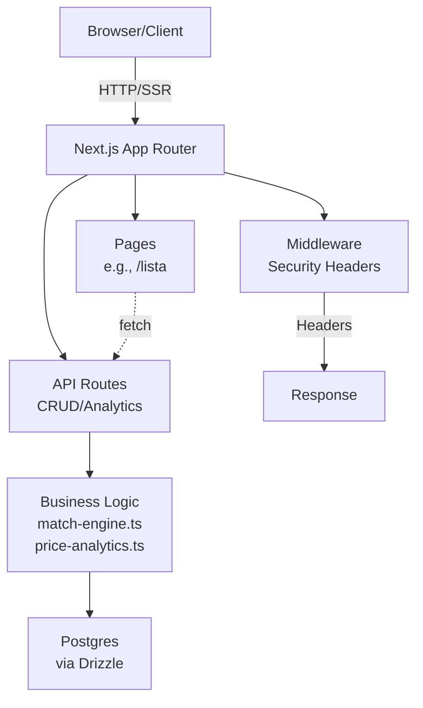

## Architecture Notes

Julius is a full-stack Next.js monolith designed as a personal shopping intelligence system. It tracks receipts, products, prices, and user needs, applying matching logic to identify deals and generate alerts. The architecture prioritizes simplicity and rapid iteration: server-side rendering for UI, API routes for operations, and a thin business logic layer in `src/lib/` that orchestrates database interactions via Drizzle ORM. This design emerged from a solo-developer workflow, favoring a single repository over microservices to minimize deployment complexity and operational overhead. Business rules like price analytics and need-matching are centralized in pure functions to ensure testability and reusability across API endpoints.

## System Architecture Overview

Julius is a **monolithic Next.js application** using the App Router paradigm, deployed likely to Vercel or similar edge platforms for serverless scaling. Requests enter via:

1. **Client → Next.js Edge Runtime**: Browser hits pages (e.g., `/lista`, `/necessidades`) or API routes (e.g., `/api/prices`).
2. **Routing Pivot**: App Router dispatches to server components/layouts or HTTP handlers in `route.ts` files.
3. **Layer Traversal**: API routes invoke `src/lib/` functions (e.g., `matchProductToNeeds`), which query the database via `src/db/index.ts`. UI pages fetch data via Server Components or API calls.
4. **Response**: JSON for APIs, RSC/SSR payloads for pages.

No separate backend service; all logic runs in-process. Middleware enforces security headers. Control flows synchronously within requests, with async DB ops.

## Architectural Layers

- **Presentation Layer**: UI components and pages (`src/components/`, `src/app/*` pages like `lista/page.tsx`, `necessidades/page.tsx`).
- **API Layer**: HTTP handlers for CRUD and analytics (`src/app/api/` subdirs: `shopping-list`, `receipts`, `products`, `prices`, `needs`, `mcp`, `alerts`, `dashboard`).
- **Business Logic Layer**: Core functions for matching, analytics, validation (`src/lib/` incl. `match-engine.ts`, `price-analytics.ts`, `utils.ts`, `validation.ts`).
- **Data Layer**: Database abstraction and seeding (`src/db/` incl. `index.ts`, `seed.ts` using Drizzle).
- **Shared Utilities**: Cross-cutting concerns like classnames and middleware (`src/lib/utils.ts`, `src/middleware.ts`).

> See [`codebase-map.json`](./codebase-map.json) for complete symbol counts and dependency graphs.

## Detected Design Patterns

| Pattern | Confidence | Locations | Description |
|---------|------------|-----------|-------------|
| Route Handler | 100% | `src/app/api/*/route.ts` | Next.js convention for HTTP methods (GET/POST/etc.) as exported functions, encapsulating endpoint logic. |
| Repository | 90% | `src/db/index.ts` (`getDb`) | Abstracts DB access; used by 2+ files for queries without direct SQL exposure. |
| Pipeline/Processor | 80% | `src/lib/match-engine.ts` (`matchProductToNeeds` → `matchAndPersist`) | Sequential data transformation: fetch needs → match → persist results. |
| Middleware | 75% | `src/middleware.ts` | Cross-cutting auth/security headers applied to all requests. |
| Analytics Facade | 70% | `src/lib/price-analytics.ts` (`getProductStats`, `isGoodDeal`) | Unified interface for price trend calculations and deal detection. |

## Entry Points

- [`src/middleware.ts`](../src/middleware.ts) — Global request preprocessing.
- [`src/app/layout.tsx`](../src/app/layout.tsx) — Root layout and providers.
- [`src/app/api/shopping-list/route.ts`](../src/app/api/shopping-list/route.ts) — Shopping list CRUD.
- [`src/app/api/receipts/route.ts`](../src/app/api/receipts/route.ts) — Receipt ingestion.
- [`src/app/api/prices/route.ts`](../src/app/api/prices/route.ts) — Price updates and queries.
- [`src/app/api/needs/route.ts`](../src/app/api/needs/route.ts) — Needs management.
- [`src/app/api/mcp/route.ts`](../src/app/api/mcp/route.ts) — Matching control plane (internal orchestration).
- [`src/app/api/dashboard/route.ts`](../src/app/api/dashboard/route.ts) — Aggregated metrics.

## Public API

| Symbol | Type | Location |
|--------|------|----------|
| `cn` | function | [`src/lib/utils.ts:4`](../src/lib/utils.ts#L4) |
| `DELETE` | function | [`src/app/api/shopping-list/route.ts:160`](../src/app/api/shopping-list/route.ts#L160) |
| `DELETE` | function | [`src/app/api/needs/route.ts:115`](../src/app/api/needs/route.ts#L115) |
| `DELETE` | function | [`src/app/api/mcp/route.ts:521`](../src/app/api/mcp/route.ts#L521) |
| `GET` | function | [`src/app/api/shopping-list/route.ts:8`](../src/app/api/shopping-list/route.ts#L8) |
| `GET` | function | [`src/app/api/receipts/route.ts:187`](../src/app/api/receipts/route.ts#L187) |
| `GET` | function | [`src/app/api/products/route.ts:7`](../src/app/api/products/route.ts#L7) |
| `GET` | function | [`src/app/api/prices/route.ts:239`](../src/app/api/prices/route.ts#L239) |
| `GET` | function | [`src/app/api/needs/route.ts:8`](../src/app/api/needs/route.ts#L8) |
| `GET` | function | [`src/app/api/mcp/route.ts:517`](../src/app/api/mcp/route.ts#L517) |
| `GET` | function | [`src/app/api/alerts/route.ts:42`](../src/app/api/alerts/route.ts#L42) |
| `GET` | function | [`src/app/api/dashboard/route.ts:6`](../src/app/api/dashboard/route.ts#L6) |
| `GET` | function | [`src/app/api/needs/[id]/route.ts:7`](../src/app/api/needs/[id]/route.ts#L7) |
| `GET` | function | [`src/app/api/analytics/[productId]/route.ts:8`](../src/app/api/analytics/[productId]/route.ts#L8) |
| `GET` | function | [`src/app/api/prices/history/[productId]/route.ts:6`](../src/app/api/prices/history/[productId]/route.ts#L6) |
| `getActiveNeeds` | function | [`src/lib/match-engine.ts:92`](../src/lib/match-engine.ts#L92) |
| `getBestPrice` | function | [`src/lib/price-analytics.ts:179`](../src/lib/price-analytics.ts#L179) |
| `getProductStats` | function | [`src/lib/price-analytics.ts:23`](../src/lib/price-analytics.ts#L23) |
| `isGoodDeal` | function | [`src/lib/price-analytics.ts:153`](../src/lib/price-analytics.ts#L153) |
| `LoginLayout` | component | [`src/app/login/layout.tsx:3`](../src/app/login/layout.tsx#L3) |
| `matchAndPersist` | function | [`src/lib/match-engine.ts:108`](../src/lib/match-engine.ts#L108) |
| `matchProductToNeeds` | function | [`src/lib/match-engine.ts:23`](../src/lib/match-engine.ts#L23) |
| `middleware` | function | [`src/middleware.ts:5`](../src/middleware.ts#L5) |
| `PATCH` | function | [`src/app/api/shopping-list/route.ts:131`](../src/app/api/shopping-list/route.ts#L131) |
| `positiveInt` | function | [`src/lib/validation.ts:16`](../src/lib/validation.ts#L16) |
| `positiveNumber` | function | [`src/lib/validation.ts:8`](../src/lib/validation.ts#L8) |
| `POST` | function | [`src/app/api/shopping-list/route.ts:73`](../src/app/api/shopping-list/route.ts#L73) |
| `POST` | function | [`src/app/api/receipts/route.ts:9`](../src/app/api/receipts/route.ts#L9) |
| `POST` | function | [`src/app/api/prices/route.ts:51`](../src/app/api/prices/route.ts#L51) |
| `POST` | function | [`src/app/api/needs/route.ts:30`](../src/app/api/needs/route.ts#L30) |
| `POST` | function | [`src/app/api/mcp/route.ts:513`](../src/app/api/mcp/route.ts#L513) |
| `ProductStats` | interface | [`src/lib/price-analytics.ts:5`](../src/lib/price-analytics.ts#L5) |
| `PUT` | function | [`src/app/api/needs/route.ts:68`](../src/app/api/needs/route.ts#L68) |
| `rematchAllProducts` | function | [`src/lib/match-engine.ts:152`](../src/lib/match-engine.ts#L152) |
| `RootLayout` | component | [`src/app/layout.tsx:13`](../src/app/layout.tsx#L13) |
| `safeError` | function | [`src/lib/validation.ts:24`](../src/lib/validation.ts#L24) |
| `sanitize` | function | [`src/lib/validation.ts:2`](../src/lib/validation.ts#L2) |
| `SpendingChart` | component | [`src/components/spending-chart.tsx:12`](../src/components/spending-chart.tsx#L12) |

## Internal System Boundaries

Domains are loosely coupled via `src/lib/` contracts:
- **Needs/Shopping**: Owned by `needs/route.ts` and `shopping-list/route.ts`; data synced via `match-engine.ts`.
- **Prices/Products**: `prices/route.ts` and `products/route.ts`; analytics in `price-analytics.ts`.
- **Receipts/Alerts**: Ingestion in `receipts/route.ts`; alerts derived from matches.
Seams enforced by interfaces (`ProductStats`, `NeedRecord`); no shared mutable state beyond DB. Synchronization via transactional `matchAndPersist`.

## External Service Dependencies

- **Database (Postgres via Drizzle)**: Connection pooled in `getDb`; no auth specified (env vars); handles retries implicitly.
- **MCP Service** (`/api/mcp`): Internal proxy/server (`createServer`, `handleMcpRequest`); potential external LLM/cloud integration—monitor rate limits if API-backed.

## Key Decisions & Trade-offs

- **Next.js App Router over Pages**: Enables RSC for zero-client-bundle data fetching; traded bundle size for server perf.
- **Pure Functions in `lib/`**: No classes/services; favors composability over OOP. Avoided full ORM (Prisma) for Drizzle's lightweight migrations.
- **Monolith**: Simpler than microservices; scales vertically to ~10k users before sharding DB.
- Experiment: `rematchAllProducts` for batching—won over real-time webhooks for cost.

## Diagrams

## Risks & Constraints

- **DB Bottleneck**: Single Postgres; >1k concurrent price updates risks locks—mitigate with read replicas.
- **Matching Scalability**: `rematchAllProducts` O(n*m); cap at 10k items or offload to queues.
- **No Caching**: Edge deployment assumes cold starts OK; add Redis for hot stats.
- **Vendor Lock**: Next.js/Vercel; DB schema evolves via Drizzle.

## Top Directories Snapshot

- `src/` — Core source (~40 files: app, lib, db, components).
- `src/app/` — Pages and API routes (~25 files).
- `src/app/api/` — Domain APIs (shopping-list, receipts, etc., ~12 files).
- `src/lib/` — Business logic (~6 files).
- `src/db/` — Data layer (2 files).
- `src/components/` — UI (~15 files).
- `docs/` — Documentation (multiple MD files).
- Root config: `drizzle.config.ts`, `next.config.ts`, `package.json`, `tailwind.config.ts` (~10 files).

## Related Resources

- [Project Overview](./project-overview.md)
- [Data Flow](./data-flow.md)
- [`codebase-map.json`](./codebase-map.json)
