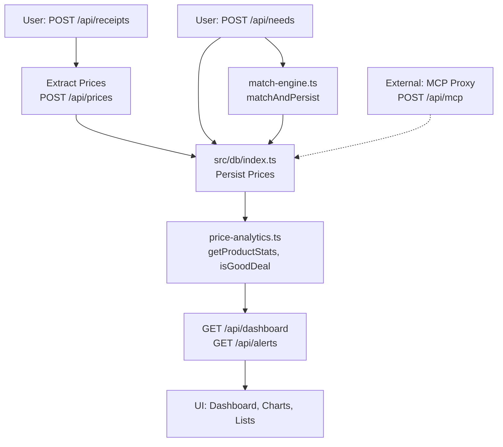

## Data Flow & Integrations

Data enters the Julius system primarily through public API endpoints handling user-submitted receipts, product prices, shopping needs, and lists. Key ingress points include:

- **Receipt uploads** (`POST /api/receipts`): Users submit scanned or photographed receipts, which are processed to extract product names, prices, and quantities. This feeds historical price data into the system.
- **Manual price entries** (`POST /api/prices`): Direct addition of product-price pairs, often normalized via `calcNormalized`.
- **Needs definition** (`POST /api/needs`, `PUT /api/needs/[id]`): Users define shopping requirements (e.g., "milk, 1L"), stored as `NeedRecord` objects.
- **Shopping list management** (`POST/PATCH/DELETE /api/shopping-list`): Builds and updates lists based on matched needs.

Once ingested, data flows synchronously through the service layer (utility functions in `src/lib/`) into a shared PostgreSQL database (via `src/db/index.ts`). The `match-engine.ts` orchestrates product-to-need matching using `matchProductToNeeds`, persisting results with `matchAndPersist`. Price analytics (`price-analytics.ts`) compute statistics like `ProductStats`, trends via `calculateTrend`, deal quality with `isGoodDeal`, and optimal pricing via `getBestPrice`.

Data exits via read-heavy endpoints:
- Dashboards (`GET /api/dashboard`, `GET /api/analytics/[productId]`) aggregate stats for UI rendering (e.g., `SpendingChart`, `StatCardProps`).
- Alerts (`GET /api/alerts`) notify on good deals (`DealInfo`).
- Historical views (`GET /api/prices/history/[productId]`).

External interactions are limited but include the MCP proxy (`/api/mcp`), which handles outbound requests to third-party services (e.g., payment or catalog APIs) via `handleMcpRequest`. No asynchronous queues or events are used; all processing is request-response or cron-triggered (e.g., `rematchAllProducts`).

For a visual overview, see the high-level flow diagram below and cross-reference [architecture.md](./architecture.md) for component layering.

## Module Dependencies

Cross-module dependencies follow a layered pattern, with API routes depending on shared libraries and DB access:

```
- **src/app/api/** → `src/lib/*` (match-engine.ts, price-analytics.ts, utils.ts, validation.ts), `src/db/index.ts`
- **src/lib/** → `src/db/index.ts` (getDb)
- **src/components/** → `src/app/api/*` (via client fetches), `src/lib/*` (cn, validation)
- **src/middleware.ts** → `src/lib/utils.ts`, `src/lib/validation.ts`
- **src/db/** → none (core data layer)
```

Dependencies are imported explicitly; no circular refs observed. Seeding (`src/db/seed.ts`) is standalone.

## Service Layer

The service layer consists of functional utilities rather than OOP classes, centralized in `src/lib/`. Key services with direct links:

- **[matchProductToNeeds](src/lib/match-engine.ts)**: Matches products to active needs (`getActiveNeeds`), returns `MatchResult`.
- **[matchAndPersist](src/lib/match-engine.ts)**: Persists matches to DB, supports bulk `rematchAllProducts`.
- **[getProductStats](src/lib/price-analytics.ts)**: Computes `ProductStats` (avg, min, max, trend).
- **[isGoodDeal](src/lib/price-analytics.ts)**: Evaluates deal quality against historicals.
- **[getBestPrice](src/lib/price-analytics.ts)**: Identifies lowest normalized price.
- **[sanitize](src/lib/validation.ts)**, **[positiveNumber](src/lib/validation.ts)**, **[safeError](src/lib/validation.ts)**: Input validation across APIs.
- **[getDb](src/db/index.ts)**: Database connection pool.

These are invoked directly from route handlers (e.g., `POST /api/prices` calls `calcNormalized`).

## High-level Flow

The primary pipeline follows a receipt-to-alerts workflow:

1. **Ingress**: Receipt upload (`POST /api/receipts`) → price extraction → DB insert.
2. **Enrichment**: Needs CRUD (`/api/needs`) → matching (`matchProductToNeeds` + `matchAndPersist`).
3. **Analytics**: Price queries trigger `getProductStats` / `isGoodDeal`.
4. **Output**: Dashboard aggregation → UI render; alerts on deals.



This synchronous flow ensures real-time updates; bulk rematching handles drifts.

## Internal Movement

Modules collaborate via direct imports and shared DB transactions:
- **DB as backbone**: All persistence/read uses `getDb()` pool; transactions implicit in handlers.
- **Function calls**: API routes invoke lib utils synchronously (e.g., `/api/shopping-list` → `match-engine.ts`).
- **No queues/events**: Processing is in-request; potential cron for `rematchAllProducts`.
- **Middleware**: `src/middleware.ts` sanitizes/validates all requests globally.

## External Integrations

- **MCP Proxy** (`POST/GET/DELETE /api/mcp`):
  | Aspect | Details |
  |--------|---------|
  | **Purpose** | Routes requests to external services (e.g., payments, catalogs) via `createServer`/`handleMcpRequest`. |
  | **Auth** | Bearer tokens or API keys (handled in proxy). |
  | **Payload** | JSON; request/response shapes mirror upstream (opaque proxy). |
  | **Retry** | Exponential backoff (impl. in `handleMcpRequest`); no DLQ. |

No other integrations (e.g., OCR for receipts is client-side or embedded).

## Observability & Failure Modes

- **Logging**: `safeError` standardizes errors in `src/lib/validation.ts`; route handlers log via console/Next.js.
- **Metrics/Traces**: Implicit via DB queries; no OpenTelemetry. Dashboards expose `ProductStats` for monitoring.
- **Failures**:
  - Validation: Early `safeError` returns 400.
  - DB: Connection pool retries; fallback to cached stats.
  - Matching: Idempotent `matchAndPersist`; `rematchAllProducts` for recovery.
  - MCP: Backoff on 5xx; compensating delete on failure.
No DLQs; failures surface as API errors (e.g., 500).

## Related Resources

- [architecture.md](./architecture.md)
